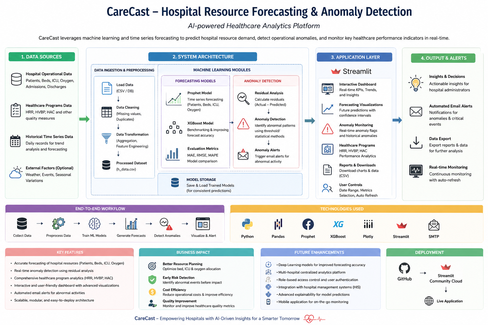
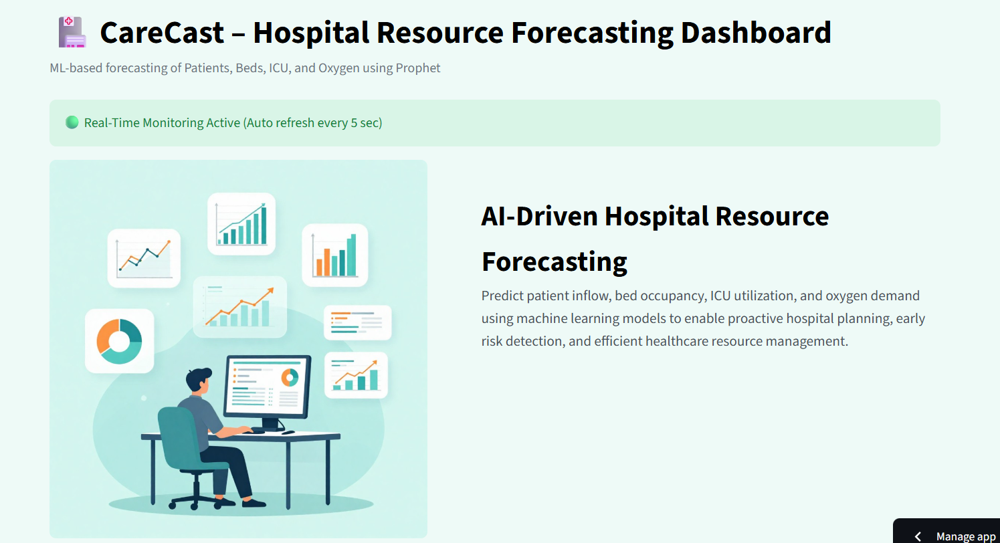
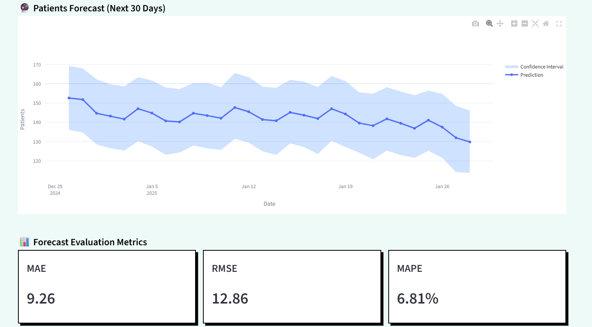
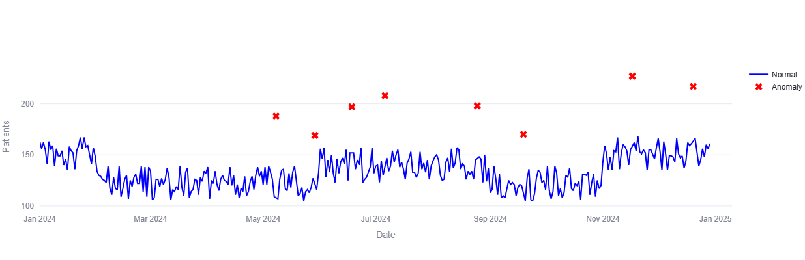
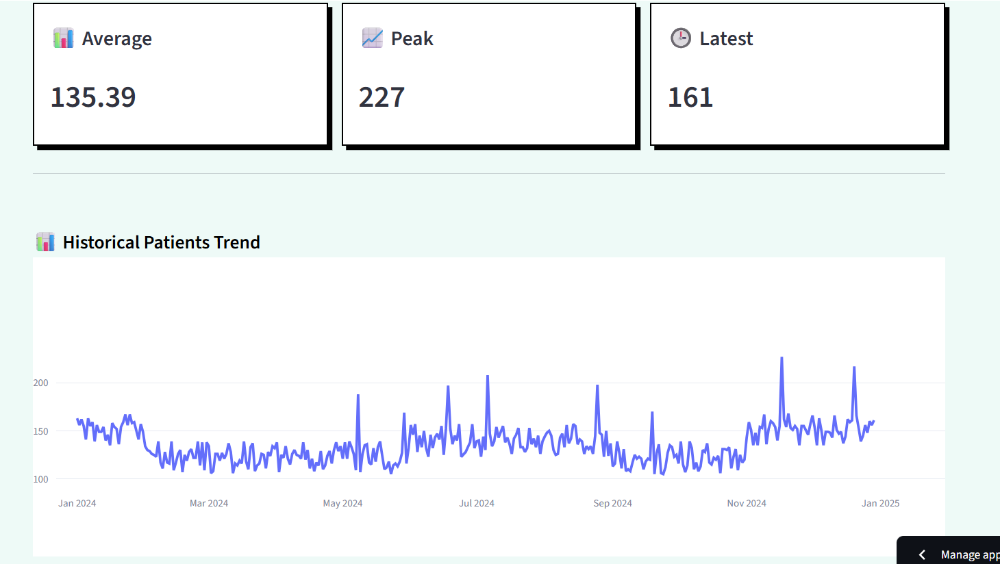
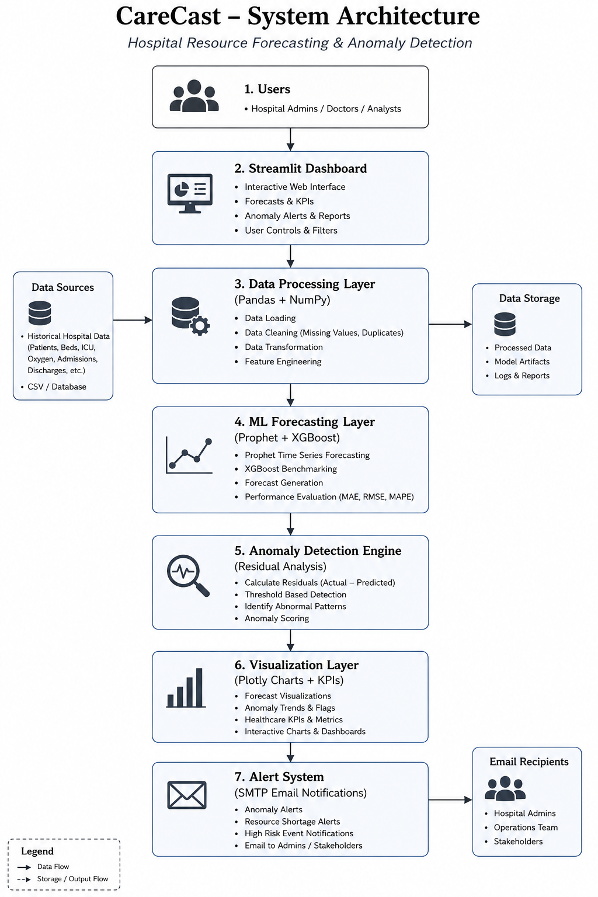
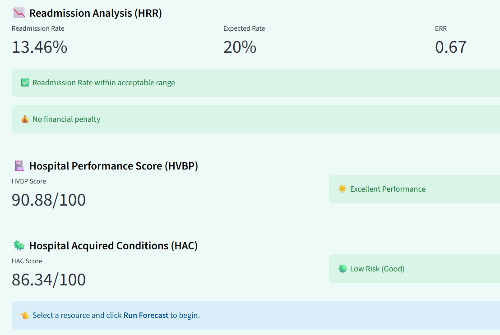

# 🏥 CareCast – Hospital Resource Forecasting & Anomaly Detection

**AI-powered healthcare analytics platform for forecasting hospital resources, detecting operational anomalies, and monitoring healthcare KPIs in real time.**

CareCast is a machine learning-based healthcare intelligence dashboard designed to help hospitals proactively manage patient inflow, optimize resource allocation, monitor healthcare performance programs, and identify abnormal operational patterns using predictive analytics.

---

# 📑 Table of Contents

1. [🚀 Live Demo](#-live-demo)
2. [📌 Overview](#-overview)
3. [✨ Key Features](#-key-features)
4. [📸 Dashboard Screenshots](#-dashboard-screenshots)
5. [🏗️ System Architecture](#️-system-architecture)
6. [🧠 Machine Learning Models](#-machine-learning-models)
7. [🏥 Healthcare Programs Analytics](#-healthcare-programs-analytics)
8. [🛠️ Tech Stack](#️-tech-stack)
9. [📂 Project Structure](#-project-structure)
10. [⚙️ Installation & Setup](#️-installation--setup)
11. [📊 Forecast Evaluation Metrics](#-forecast-evaluation-metrics)
12. [🚧 Future Improvements](#-future-improvements)
13. [👨‍💻 Author](#-author)

---

# 🚀 Live Demo

<p align="left">
<a href="https://carecast-pdtqgndahdnyectvgvaqfu.streamlit.app/" target="_blank">

</a>
</p>

---

# 📌 Overview

CareCast is a machine learning-based healthcare intelligence dashboard developed to help hospitals proactively monitor and forecast critical healthcare resources such as patient inflow, bed occupancy, ICU utilization, and oxygen demand.

The platform combines forecasting models, anomaly detection systems, healthcare KPI analytics, and automated alert mechanisms into a single interactive dashboard for real-time operational monitoring.

<p align="center">

</p>

---

# ✨ Key Features

- 📈 Forecasting of Patients, Beds, ICU, and Oxygen Demand
- 🤖 Prophet & XGBoost-based predictive analytics
- 🚨 Real-time anomaly detection using residual analysis
- 📊 Forecast evaluation using MAE, RMSE, and MAPE
- 🏥 HRR, HVBP, and HAC healthcare analytics monitoring
- 📉 Interactive visualizations using Plotly
- ⚡ Real-time dashboard monitoring with auto-refresh
- 📧 Automated SMTP email notifications for abnormal events
- ☁️ Fully deployed Streamlit cloud application

---

# 📸 Dashboard Screenshots

## 🏥 Main Dashboard

<p align="center">

</p>

---

## 📈 Forecast Visualization

<p align="center">

</p>

---

## 🚨 Anomaly Detection

<p align="center">

</p>

---

## 📊 Historical Resource Trends

<p align="center">

</p>

---

# 🏗️ System Architecture

The CareCast architecture follows a modular healthcare analytics workflow consisting of data ingestion, preprocessing, machine learning forecasting, anomaly detection, visualization, and automated alert generation.

<p align="center">

</p>

---

# 🧠 Machine Learning Models

## 🔹 Prophet Forecasting Model

Prophet is used for time-series forecasting of:

- Patient inflow
- Bed occupancy
- ICU utilization
- Oxygen demand

The model captures:

- Seasonal healthcare trends
- Time-based variations
- Long-term demand patterns

---

## 🔹 XGBoost Benchmarking Model

XGBoost is integrated to benchmark forecasting performance and improve prediction accuracy using engineered time-series features such as:

- Month
- Day
- Week
- Day of Week

---

## 🔹 Residual-Based Anomaly Detection

Anomalies are detected using residual analysis:

```text
Residual = Actual Value − Predicted Value
```

Residuals exceeding statistical thresholds are flagged as abnormal events.

Examples include:

- Sudden patient surges
- Resource shortages
- ICU spikes
- Abnormal oxygen demand

---

# 🏥 Healthcare Programs Analytics

CareCast integrates healthcare quality monitoring programs commonly used in hospital performance evaluation.

## 📉 HRR – Hospital Readmission Reduction

Monitors:

- Readmission rate
- Expected readmission ratio
- Penalty risks

---

## 🏆 HVBP – Hospital Value-Based Purchasing

Tracks:

- Hospital performance score
- Quality metrics
- Operational efficiency

---

## 🦠 HAC – Hospital Acquired Conditions

Analyzes:

- Risk levels
- Safety indicators
- Hospital-acquired condition metrics

<p align="center">

</p>

---

# 🛠️ Tech Stack

| Layer | Technologies |
| :-- | :-- |
| **Frontend & Dashboard** | Streamlit, HTML/CSS |
| **Visualization** | Plotly |
| **Machine Learning** | Prophet, XGBoost, Scikit-learn |
| **Data Processing** | Pandas, NumPy |
| **Alerts & Notifications** | SMTP Email Services |
| **Deployment** | Streamlit Community Cloud |
| **Version Control** | Git, GitHub |

---

# 📂 Project Structure

```bash
CareCast/
│
├── dashboard/
│   └── app.py
│
├── data/
│   └── h_data.csv
│
├── models/
│   ├── anomaly_detection.py
│   ├── forecasting_beds.py
│   ├── icu_forecasting.py
│   └── oxygen_forecasting.py
│
├── assets/
│   ├── hero.png
│   ├── overview.png
│   ├── architecture.png
│   ├── dashboard.png
│   ├── forecast.png
│   ├── anomaly.png
│   ├── historical_data.png
│   └── h_programs.png
│
├── requirements.txt
├── packages.txt
└── README.md
```

---

# ⚙️ Installation & Setup

## 1️⃣ Clone Repository

```bash
git clone https://github.com/PurushothamaReddyM/CareCast.git
cd CareCast
```

---

## 2️⃣ Create Virtual Environment

```bash
python -m venv .venv
```

### Activate Environment

#### Windows

```bash
.venv\Scripts\activate
```

#### Linux / Mac

```bash
source .venv/bin/activate
```

---

## 3️⃣ Install Dependencies

```bash
pip install -r requirements.txt
```

---

## 4️⃣ Run Application

```bash
streamlit run dashboard/app.py
```

---

# 📊 Forecast Evaluation Metrics

CareCast evaluates forecasting performance using:

- 📉 MAE (Mean Absolute Error)
- 📉 RMSE (Root Mean Squared Error)
- 📉 MAPE (Mean Absolute Percentage Error)

These metrics help compare forecasting performance across forecasting models.

---

# 🚧 Future Improvements

- Multi-hospital support
- Deep learning forecasting models
- API integration with hospital systems
- Role-based authentication
- PDF analytics reporting
- Real-time streaming data pipelines
- Explainable AI dashboards

---

# 👨‍💻 Author

## Purushothama Reddy M

<p align="left">

<a href="mailto:machupalli.purushoth2023@vitstudent.ac.in" target="blank">

</a>


<a href="https://www.linkedin.com/in/machupalli-purushothama-reddy-8544793b4/" target="blank">

</a>


<a href="https://github.com/PurushothamaReddyM" target="blank">

</a>

</p>
